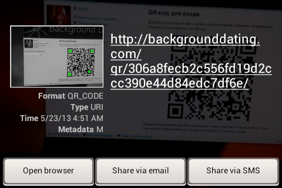

What is django-qrauth?
======================

django-qrauth allows you to easily spice up your website with instant user authentication: once a user has signed in on their Mac or PC, they can pick up their smartphone (or tablet, iPod, etc: actually, anything that has Internet access, a camera and a QR code scanning application should work), scan a QR code (which appears on the display after the user clicks the corresponding link) and immediately sign in on their smartphone or other mobile device they use (so they don’t have to enter the site address, their login/email and password).

You can see the detailed walkthrough in [this screencast](http://www.youtube.com/watch?v=6ob3oR_Frhk) (in Russian) and in [this blog post](http://habrahabr.ru/post/181093/) (also in Russian).

Visit [Background Dating](http://backgrounddating.com/) to see this in action.

Installation
============

Step 1
------

Install [Redis](http://redis.io/).

Step 2
------

Install django-qrauth:

    pip install django-qrauth

Step 3
------

Open your templates directory and add the following templates: qrauth/invalid_code.html and qrauth/page.html. For example:

**qrauth/invalid_code.html**

    

    Invalid QR code

    
    

        <h1>Invalid QR code</h1>
        
The QR code you are using for authentication is invalid. Please try to open the page with the QR code again and then rescan it.

    

    

**qrauth/page.html**

    

    Authentication QR code

    
    

        <h1>Authentication QR code</h1>
        
Scan this QR code to instantly sign in to the website on your mobile device (a smartphone, a tablet, etc):

        

        
Every generated QR code only works once and only for 5 minutes. If you need another QR code, just open <a href="">this page</a> again.

    

    

Step 4
------

Open your root urlconf (the module is specified in the ROOT_URLCONF setting) and include the URLs used by the qrauth application:

    urlpatterns = patterns('',
        # …
        url(r'^qr/', include('qrauth.urls')),
        # …
    )

Configuration
=============

You may also want to set a custom expiration time. Each QR code is valid for 300 seconds (5 minutes) by default. If you want to change this behavior, change the value of AUTH_QR_CODE_EXPIRATION_TIME setting. AUTH_QR_CODE_EXPIRATION_TIME is in seconds. For example:

    AUTH_QR_CODE_EXPIRATION_TIME = 600 # Ten minutes

If you want to specify the page where the user should be redirected after successfully signing in with a QR code, you have to set the URL using the AUTH_QR_CODE_REDIRECT_URL setting. For example:

    AUTH_QR_CODE_REDIRECT_URL = "/welcome/"

The user is redirected to "/" by default (which is usually the index page).

If you need to specify custom Redis connection settings, you can use the AUTH_QR_CODE_REDIS_KWARGS setting. It is a dictionary of keyword arguments that are passed to the redis.StrictRedis class when initializing Redis connections. For example:

    AUTH_QR_CODE_REDIS_KWARGS = {
        "host": "localhost",
        "port": 6379,
        "db": 0,
    }

Also, make sure that [LOGIN_URL](https://docs.djangoproject.com/en/dev/ref/settings/#login-url) has a correct value. Otherwise, users can be redirected to a page that does not exist (for example, if someone not authenticated tries to open the page with the QR code).

How to test
===========

If you want to test this locally, make sure that your local web server is available from your mobile device. For example, if your computer and your mobile device are both connected to the same LAN, you should specify your LAN IP address (something like 192.168.0.5:8000 or 0.0.0.0:8000 if you want the web server to listen on all network interfaces) in order to make the web server listen on this address.

If you use [the “sites” framework](https://docs.djangoproject.com/en/dev/ref/contrib/sites/) (django.contrib.sites), make sure you have correcly set the domain for the current site.

For example, if your LAN IP address is 192.168.0.5 and the development server is listening on port 8000, the domain should be 192.168.0.5:8000. You can set it in the admin interface (/admin/sites/site/).

If you don’t have the “sites” framework enabled, the current site domain will be dynamically determined based on the “Host” header (the get_host() method of the HttpRequest object is used in that case), so even if the development server is listening on both loopback interface and the LAN interface, you should open the website using the LAN IP address (otherwise your mobile device won’t be able to browse to the authentication URL as a loopback interface’s IP will be used in the link).

Now it’s time to try the QR code authentication. Make sure that you are logged in, browse to /qr/ (or use other path if you have specified something else in your root urlconf), pick up your mobile device and try to scan it.

Note that some QR code readers try to prefetch the page’s contents (e.g. to show you the page title), so the QR code will become invalid when you actually open the URL in your web browser. In that case, try to change the settings of your QR code scanning app.

Security concerns
=================

1. If there are XSS vulnerabilities on the website, an attacker may be able to use iframes (at least if you haven’t set the [X-Frame-Options](https://developer.mozilla.org/en-US/docs/HTTP/X-Frame-Options) header to DENY) or XMLHttpRequest to retrieve an authentication QR code and use it to log into the user’s account.

2. Even without any XSS, it is possible for someone who has access to the user’s session (for example, if the user is still logged in on the website, but is away from the computer) to scan the QR code and therefore to log into the user’s account.

Possible solutions include sending the QR code by email (actually, some users are always logged into their email accounts as well, so this might be meaningless except for the fact that the QR code will not be available from the attacker’s JS) or prompting the user for their password before displaying the QR code (it is still much easier to type the password on a desktop/laptop computer’s keyboard rather than to type the site address + login or email + password on a mobile device’s virtual keyboard).

Of course, even if you implement such protection, you should still carefully check your website for XSS (and other vulnerabilities, such as SQL injections, CSRF, etc), set the session ID cookies with the [HttpOnly](http://en.wikipedia.org/wiki/HTTP_cookie#HttpOnly_cookie) flag and so on. For instance, it would be even worse to accidentally let an attacker know the user’s password (if the user is prompted for the password on a page with some attacker’s JS) than just let them obtain a new session (which only means access to the account, without the password being exposed).

The general rule here is “think before you do”. Features can be both handy and secure.

A note on HTTP/HTTPS
--------------------

If your web server is behind a reverse proxy (like nginx) and you use SSL for your website, please make sure that the upstream (the web server that you use to run your Django website) is being informed about that, so request.is_secure() will act correctly (so the authentication URLs will have correct scheme). You can do that by adding the [SECURE_PROXY_SSL_HEADER](https://docs.djangoproject.com/en/dev/ref/settings/#secure-proxy-ssl-header) setting and supplying the corresponding header from the reverse proxy (but don’t forget to _always_ set or strip this header, in all the requests the reverse proxy sends to the upstream: otherwise, say, if your website is available via both HTTP and HTTPS, then a user opening the website via HTTP will be able to set this header at the client side, so request.is_secure() will return True, which is not good from the point of security).
